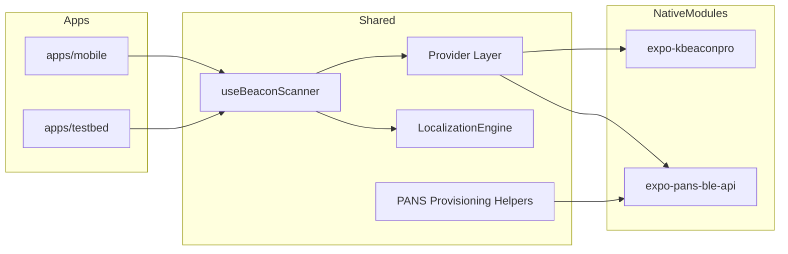
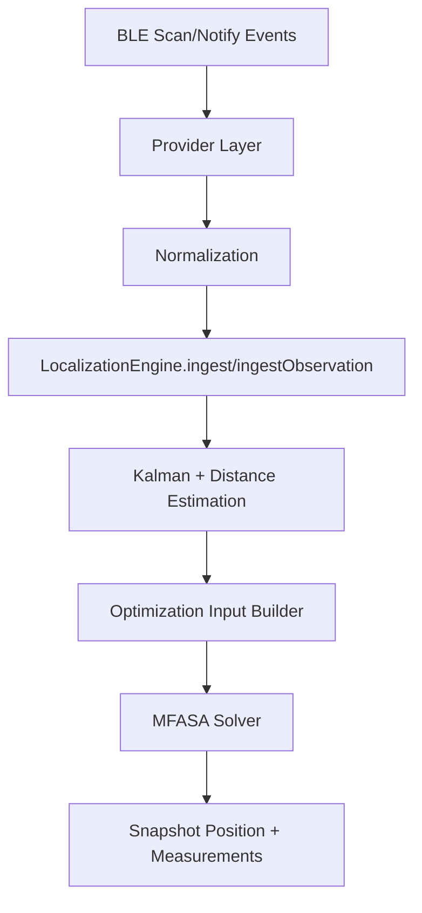
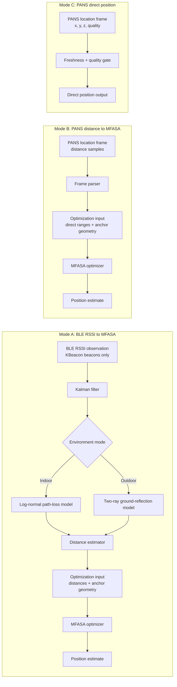

# Eight2Five Mobile Monorepo

This repository contains the production mobile client, feature testbed, shared localization engine, and custom Expo native modules used for BLE/UWB-oriented positioning workflows.

## Repository Structure

- Apps
	- [apps/mobile](apps/mobile): production app used on-field.
	- [apps/testbed](apps/testbed): sandbox for algorithm and model experiments.
- Shared package
	- [packages/shared](packages/shared): scanner hook, provider abstraction layer, localization engine, parsers, and provisioning helpers.
- Native modules
	- [modules/expo-kbeaconpro](modules/expo-kbeaconpro): KBeaconPro scan/connect/configure module.
	- [modules/expo-pans-ble-api](modules/expo-pans-ble-api): BLE TLV command/event interface for DWM1001/PANS.
- Native stubs for Swift tooling
	- [Package.swift](Package.swift), [Sources](Sources)

## Quick Start

```bash
npm ci
npm run start:mobile
npm run start:testbed
```

## Validation Commands

```bash
npm run type-check
npm run lint
npm run test
```

## High-Level Architecture



## End-to-End Data Flow

### 1) Data Collection

- `expo-kbeaconpro` emits scanned beacon advertisements.
- `expo-pans-ble-api` emits discovered BLE devices and notification payloads for PANS location frames.
- `@eight2five/shared` providers normalize both into source-agnostic events.

### 2) Normalization and Ingestion

- KBeacon packets are parsed by `parseBeaconData` into beacon state.
- PANS location data is parsed by `parsePansLocationDataPayload` and converted by `locationFrameToObservations`.
- `useBeaconScanner` ingests both raw beacons and normalized observations.

### 3) Measurement Processing

- RSSI observations are smoothed with a 1D Kalman filter.
- For RSSI-driven positioning, distance is estimated from propagation models.
- For PANS distance observations, direct distance measurements are used.
- For PANS direct position observations, position can be used directly (freshness-gated).
- PANS discovery RSSI is treated as device telemetry and is not used for localization estimation.

### 4) Position Solve

- `LocalizationEngine` builds optimization input with fresh measurements + configured anchor geometry.
- `MFASAOptimizer` searches candidate positions minimizing model error.
- Snapshot exposes:
	- current position estimate
	- filtered measurements
	- beacon/observation state



## Calculation Pipeline Details

- Indoor path loss: log-normal model.
- Outdoor path loss: two-ray ground-reflection model.
- Optimizer: memetic Firefly Algorithm + simulated annealing behavior (`MFASA`).
- Time slicing: optimization runs in throttled slices to avoid UI-thread blocking.
- Source preference in auto mode:
	- Fresh PANS UWB distance/position observations are preferred.
	- RSSI fallback remains available when fresh PANS ranging is absent, using KBeacon beacon RSSI only.

## Position Estimation Modes

The localization stack supports three practical paths to a position output.



Mode behavior summary:

- Mode A is the RSSI-based path, sourced from KBeacon beacon advertisements only, and uses the selected propagation model before optimization.
- Mode B uses direct UWB distance observations from PANS and still solves via MFASA.
- Mode C bypasses optimization and uses direct PANS position data when fresh.

## Anchor Geometry Freshness Strategy

Anchor geometry is static configuration, but anchor presence is dynamic. To prevent operational staleness:

1. Periodically observe anchors from a connected tag.
2. Reconcile observed anchor keys/node IDs against stored field configuration.
3. Flag unresolved observed anchors and stale configured anchors.

Use shared helpers from [packages/shared/src/providers/PansProvisioning.ts](packages/shared/src/providers/PansProvisioning.ts):

- `observeTagAnchors`
- `reconcileFieldAnchorsFromTag`
- `startAnchorReconciliationLoop`

Example:

```ts
import {
	startAnchorReconciliationLoop,
} from "@eight2five/shared";

const loop = startAnchorReconciliationLoop({
	fieldId: "practice-field-a",
	tagAddress: "AA:BB:CC:DD:EE:FF",
	store: fieldConfigurationStore,
	intervalMs: 10_000,
	onReconciled: (result) => {
		if (result.unresolvedObservedAnchorKeys.length > 0) {
			console.warn("Observed anchors missing geometry", result.unresolvedObservedAnchorKeys);
		}
		if (result.staleConfiguredAnchorKeys.length > 0) {
			console.warn("Configured anchors not recently observed", result.staleConfiguredAnchorKeys);
		}
	},
});

// later
loop.stop();
```

## Helper Function Map

### Shared Hook / Engine

- `useBeaconScanner`: high-level app integration point.
- `LocalizationEngine`: ingestion, filtering, and solve orchestration.

### Shared Provider Factories

- `createKBeaconSource`
- `createPansBleSource`
- `createAutoBeaconSource`
- `createBeaconSource`

### Shared PANS Provisioning Helpers

- `setupTag`
- `setupAnchorNode`
- `configureTag`
- `configureAnchorNode`
- `readTagOperationMode`
- `readAnchorOperationMode`
- `observeTagAnchors`
- `reconcileFieldAnchorsFromTag`
- `startAnchorReconciliationLoop`
- `commissionFieldFromTag`

### Parsing Helpers

- `parseBeaconData`
- `parsePansLocationDataPayload`
- `locationFrameToObservations`
- `toAnchorKey`

## Module API Documentation

- KBeacon module API: [modules/expo-kbeaconpro/README.md](modules/expo-kbeaconpro/README.md)
- PANS BLE module API: [modules/expo-pans-ble-api/README.md](modules/expo-pans-ble-api/README.md)

## CI and Workflow Notes

- Workspace-wide checks run via root scripts.
- Expo app configs include module config plugins for Bluetooth/location permission setup.
- Swift stubs under [Sources](Sources) support linting/tooling on non-macOS environments and are not runtime production code.
