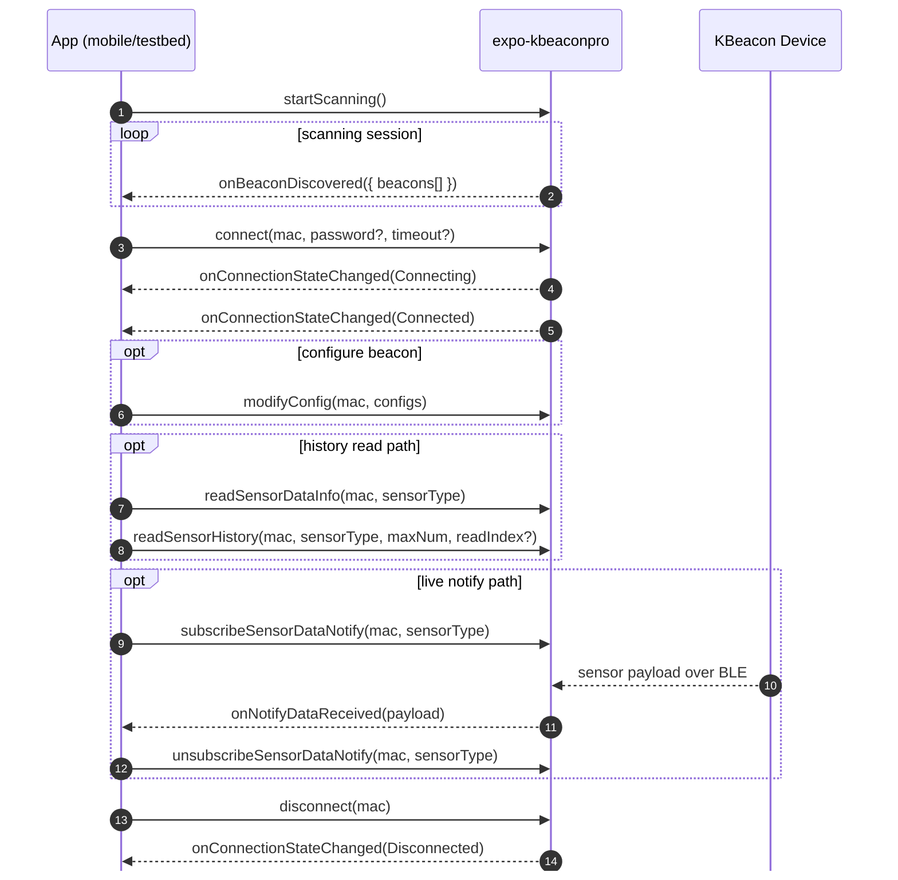

# expo-kbeaconpro

Expo native module wrapper for KKMHogen KBeaconPro BLE scanning, connection, configuration, and sensor-history operations.

## Scope

- Platform support: iOS and Android via Expo Modules
- Primary responsibilities:
  - Discover nearby KBeacon devices
  - Connect/disconnect to individual beacons
  - Modify beacon configs
  - Read/clear sensor history
  - Subscribe to sensor notifications

## Installation and Wiring

This monorepo already consumes the module via file dependency.

If adding manually in another workspace:

```bash
npm install expo-kbeaconpro
```

Add the config plugin in app config:

```ts
plugins: [
  [
    "expo-kbeaconpro",
    {
      bluetoothAlwaysUsageDescription:
        "This app uses Bluetooth to scan and communicate with KBeacon devices.",
      bluetoothPeripheralUsageDescription:
        "This app uses Bluetooth to scan and communicate with KBeacon devices.",
      locationWhenInUseUsageDescription:
        "Location permission is required for BLE scanning.",
    },
  ],
];
```

Plugin implementation: [app.plugin.js](app.plugin.js)

## Runtime Event Model

Event names are defined in [src/ExpoKBeaconPro.types.ts](src/ExpoKBeaconPro.types.ts).

- `onBeaconDiscovered`
- `onConnectionStateChanged`
- `onNotifyDataReceived`

Subscribe with:

- `addBeaconDiscoveredListener`
- `addConnectionStateChangedListener`
- `addNotifyDataReceivedListener`

## Public API

Wrappers are exported from [src/ExpoKBeaconProModule.ts](src/ExpoKBeaconProModule.ts) and re-exported from [index.tsx](index.tsx).

### Scanning

- `startScanning(): void`
- `stopScanning(): void`
- `clearBeacons(): void`

### Connection Lifecycle

- `connect(macAddress: string, password?: string, timeout?: number): Promise<boolean>`
- `connectEnhanced(macAddress: string, password?: string, timeout?: number, connPara?: KBConnPara): Promise<boolean>`
- `disconnect(macAddress: string): Promise<boolean>`

### Configuration

- `modifyConfig(macAddress: string, configs: KBCfgBase[]): Promise<boolean>`

### Sensor Data and Notifications

- `readSensorDataInfo(macAddress: string, sensorType: KBSensorType): Promise<KBSensorDataInfo>`
- `readSensorHistory(macAddress: string, sensorType: KBSensorType, maxNum: number, readIndex?: number): Promise<KBSensorDataRecord[]>`
- `clearSensorHistory(macAddress: string, sensorType: KBSensorType): Promise<boolean>`
- `subscribeSensorDataNotify(macAddress: string, sensorType: KBSensorType): Promise<boolean>`
- `unsubscribeSensorDataNotify(macAddress: string, sensorType: KBSensorType): Promise<boolean>`

## Core Data Types

Defined in [src/ExpoKBeaconPro.types.ts](src/ExpoKBeaconPro.types.ts).

### Beacon and Event Types

- `KBeacon`
- `ConnectionStateChangeEvent`
- `NotifyDataEvent`
- `KBConnState`
- `KBConnEvtReason`

### Advertisement Packet Types

Discriminator enum: `KBAdvType`

Supported packet interfaces include:

- `KBAdvPacketIBeacon`
- `KBAdvPacketEddyTLM`
- `KBAdvPacketEddyUID`
- `KBAdvPacketEddyURL`
- `KBAdvPacketSensor`
- `KBAdvPacketSystem`
- `KBAdvPacketEBeacon`

### Configuration Types

Base + common:

- `KBCfgBase`
- `KBCfgCommon`
- `KBAdvMode`

Advertisement config variants:

- `KBCfgAdvBase`
- `KBCfgAdvIBeacon`
- `KBCfgAdvEddyURL`
- `KBCfgAdvEddyUID`
- `KBCfgAdvEddyTLM`
- `KBCfgAdvKSensor`
- `KBCfgAdvEBeacon`
- `KBCfgAdvNull`

Trigger config variants:

- `KBCfgTrigger`
- `KBCfgTriggerMotion`
- `KBCfgTriggerAngle`
- `KBTriggerType`
- `KBTriggerAction`

Sensor config variants:

- `KBCfgSensorHT`
- `KBCfgSensorLight`
- `KBCfgSensorGEO`
- `KBCfgSensorScan`
- `KBCfgSensorPIR`
- `KBCfgSensorBase`
- `KBSensorType`

Sensor data structures:

- `KBSensorDataInfo`
- `KBSensorDataRecord`

Connection parameter helper:

- `KBConnPara`

## Typical Flow



## Example Usage

```ts
import {
  addBeaconDiscoveredListener,
  addConnectionStateChangedListener,
  startScanning,
  stopScanning,
  connect,
  disconnect,
} from "expo-kbeaconpro";

const discoveredSub = addBeaconDiscoveredListener(async ({ beacons }) => {
  const first = beacons[0];
  if (!first) return;

  await connect(first.mac);
});

const connSub = addConnectionStateChangedListener((event) => {
  console.log("Connection state", event.macAddress, event.state, event.reason);
});

startScanning();

// cleanup
stopScanning();
discoveredSub.remove();
connSub.remove();
await disconnect("AA:BB:CC:DD:EE:FF");
```

## Operational Notes

- BLE permissions are injected by the config plugin.
- On iOS, Bluetooth and location usage descriptions must be present in Info.plist (plugin handles defaults).
- On Android 12+, BLE scan/connect permissions are required (plugin adds them).
- API calls are async wrappers around native module methods; error semantics depend on the native implementation.

## Source Files

- Entry: [index.tsx](index.tsx)
- JS wrapper: [src/ExpoKBeaconProModule.ts](src/ExpoKBeaconProModule.ts)
- Type definitions: [src/ExpoKBeaconPro.types.ts](src/ExpoKBeaconPro.types.ts)
- Expo module config: [expo-module.config.json](expo-module.config.json)
