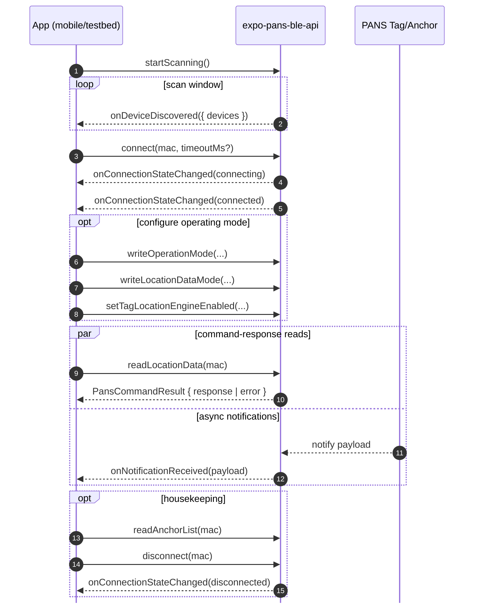

# expo-pans-ble-api

Expo native module for BLE-based DWM1001/PANS command and event integration.

## Scope and Intent

- Transport support: BLE only
- Command mode: TLV command wrappers over BLE service/characteristic operations
- Out of scope in this phase:
	- UART host API transport
	- SPI host API transport

This module is the low-level transport layer used by shared providers and provisioning helpers.

## Installation and Configuration

The monorepo already links this as a file dependency. For external use:

```bash
npm install expo-pans-ble-api
```

Add plugin in app config:

```ts
plugins: [
	[
		"expo-pans-ble-api",
		{
			bluetoothAlwaysUsageDescription:
				"This app uses Bluetooth to communicate with nearby DWM1001 devices.",
			bluetoothPeripheralUsageDescription:
				"This app uses Bluetooth to communicate with nearby DWM1001 devices.",
			locationWhenInUseUsageDescription:
				"Location permission is required for BLE scanning.",
		},
	],
];
```

Plugin source: [app.plugin.js](app.plugin.js)

## Event Model

Events are defined in [src/ExpoPansBleApi.types.ts](src/ExpoPansBleApi.types.ts):

- `onDeviceDiscovered`
- `onConnectionStateChanged`
- `onNotificationReceived`
- `onError`

Listener APIs in [src/ExpoPansBleApiModule.ts](src/ExpoPansBleApiModule.ts):

- `addDeviceDiscoveredListener`
- `addConnectionStateChangedListener`
- `addNotificationReceivedListener`
- `addErrorListener`

## Public API Reference

### Discovery and Capability

- `startScanning(): void`
- `stopScanning(): void`
- `clearDevices(): void`
- `getCapabilities(): PansApiCapabilities`

### Connection Lifecycle

- `connect(macAddress: string, timeoutMs?: number): Promise<boolean>`
- `disconnect(macAddress: string): Promise<boolean>`

### Generic TLV Execution

- `executeCommand(macAddress: string, request: PansTlvRequest): Promise<PansCommandResult>`

### Command Helpers

- `readLocationData(macAddress)`
- `readProxyPositions(macAddress)`
- `readOperationMode(macAddress)`
- `writeLocationDataMode(macAddress, mode)`
- `writeOperationMode(macAddress, [byte0, byte1])`
- `setTagLocationEngineEnabled(macAddress, enabled)`
- `writePersistedPosition(macAddress, { xMeters, yMeters, zMeters?, quality? })`
- `readAnchorList(macAddress)`
- `pushFwUpdatePayload(macAddress, payload)`

## TLV Command Type Mapping

Defined in `PansCommandType` enum:

- `0x90`: `readLocationData`
- `0x91`: `readProxyPositions`
- `0x92`: `readOperationMode`
- `0x93`: `writeLocationDataMode`
- `0x94`: `writeOperationMode`
- `0x95`: `writePersistedPosition`
- `0x96`: `readAnchorList`
- `0xA0`: `fwUpdatePush`

## Core Types

Key interfaces in [src/ExpoPansBleApi.types.ts](src/ExpoPansBleApi.types.ts):

- `PansBleDevice`
	- `mac`
	- `name?`
	- `rssi`
	- `lastSeenMs`
- `PansTlvRequest`
- `PansTlvResponse`
- `PansCommandResult`
- `PansApiCapabilities`
- `ConnectionStateChangeEvent`
- `NotifyDataEvent`
- `PansApiError`

## Data and Validation Constraints

Wrapper validations in [src/ExpoPansBleApiModule.ts](src/ExpoPansBleApiModule.ts):

- MAC address validation:
	- Colon-delimited MAC (typical Android)
	- iOS peripheral UUID format
- TLV request validation:
	- command type: integer `0..255`
	- payload bytes: each integer `0..255`
	- payload length: max `253`

## Discovery to Ranging Flow



## Advertisement Data Limits

Current device-discovery payloads expose:

- `mac`
- `name`
- `rssi`
- `lastSeenMs`

This is sufficient for liveness/freshness checks, but not sufficient to derive full anchor geometry directly from BLE advertisements alone. In this project, PANS discovery RSSI is treated as metadata and is not used as a localization RSSI input.

Recommended approach for geometry freshness in shared logic:

1. Use periodic `observeTagAnchors` calls from a connected tag.
2. Reconcile observed anchors with stored field config via `reconcileFieldAnchorsFromTag`.
3. Run continuously with `startAnchorReconciliationLoop`.

## Example Usage

```ts
import {
	addDeviceDiscoveredListener,
	addNotificationReceivedListener,
	connect,
	readLocationData,
	startScanning,
	stopScanning,
} from "expo-pans-ble-api";

const discoveredSub = addDeviceDiscoveredListener(async ({ devices }) => {
	const device = devices[0];
	if (!device) return;

	const ok = await connect(device.mac, 10_000);
	if (!ok) return;

	const frame = await readLocationData(device.mac);
	console.log(frame);
});

const notifySub = addNotificationReceivedListener((event) => {
	console.log("Notify payload", event.macAddress, event.payload);
});

startScanning();

// cleanup
stopScanning();
discoveredSub.remove();
notifySub.remove();
```

## Source Files

- Entry exports: [index.ts](index.ts)
- Wrapper implementation: [src/ExpoPansBleApiModule.ts](src/ExpoPansBleApiModule.ts)
- Types: [src/ExpoPansBleApi.types.ts](src/ExpoPansBleApi.types.ts)
- Expo module config: [expo-module.config.json](expo-module.config.json)
